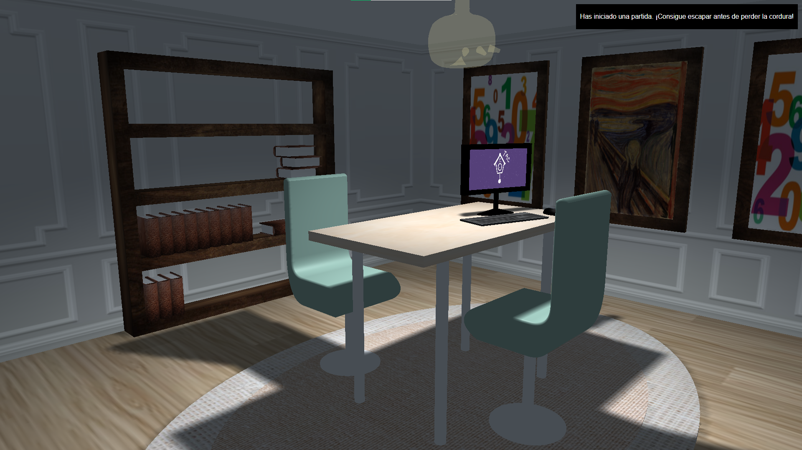
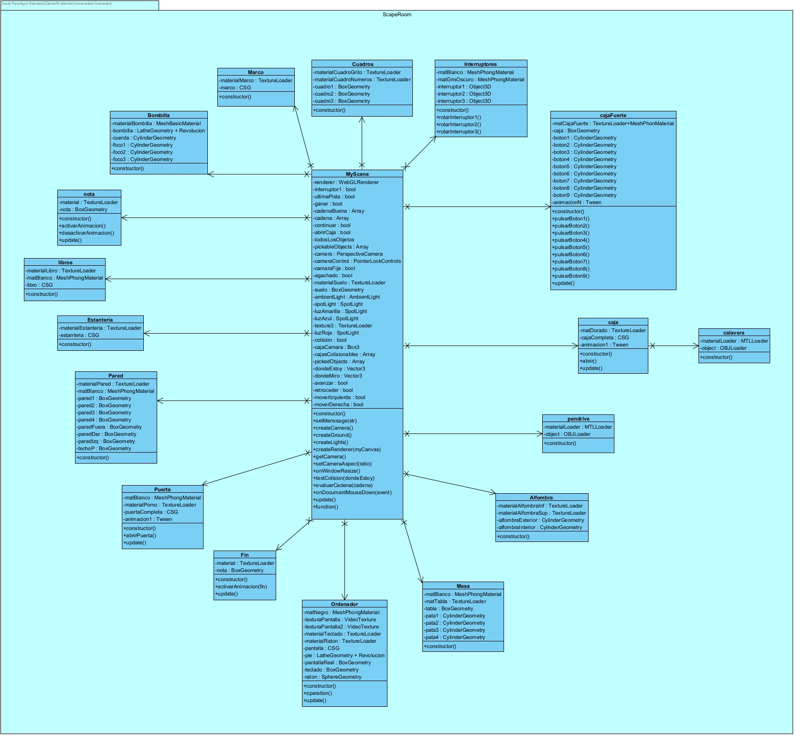
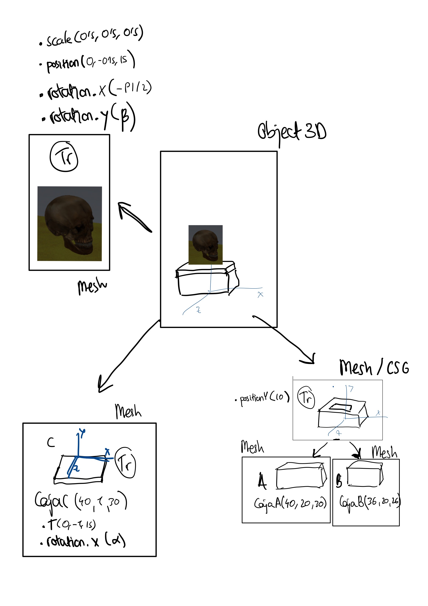

# La casa de los secretos

La casa de los secretos es un videojuego interactivo tipo *Scape Room* creado en **JavaScript** con la librería **three.js**, que es una potente librería de código abierto para JavaScript que se utiliza para crear y mostrar gráficos 3D y animaciones en un navegador web.

**Autores**:
* [Denis Stoyanov](https://github.com/denissvalentin)
* [Alba Guisado](https://github.com/albaguisadof)



---

## 📜 Descripción

"La casa de los secretos" es un *Scape Room* que se desarrolla en una única habitación llena de misterios. El objetivo principal es **resolver 3 pistas** que se encuentran interconectadas para poder abrir la puerta y escapar antes de que sea demasiado tarde. A lo largo de la partida, recibirás mensajes en la esquina superior derecha que te guiarán y te darán información crucial sobre tu progreso.

---

## ⚙️ Características Técnicas

La implementación del videojuego incluye varios elementos técnicos destacables:

* **Motor de colisiones**: Para evitar que el jugador atraviese paredes y objetos, se implementó un sistema de colisiones que envuelve tanto a la cámara como a los objetos sólidos de la escena en cajas de colisión (`bounding box`).
* **Animaciones**: Varios objetos cuentan con animaciones para mejorar la interacción, como la apertura de la caja del pendrive en 2 segundos, la pulsación de los botones de la caja fuerte o el movimiento de la nota.
* **Interacción (Picking)**: El juego utiliza una técnica de *picking* con el ratón que lanza un rayo desde la cámara para detectar sobre qué objeto se ha hecho clic, permitiendo interactuar con elementos clave como libros, interruptores o el ordenador.
* **Luces y sombras dinámicas**: La escena cuenta con 5 tipos de luces, incluyendo una luz ambiental, focos (`spotLight`) que se encienden con los interruptores y una luz principal que parpadea. Ciertos objetos proyectan y reciben sombras para dar más realismo a la escena.
* **Texturas complejas**: Se utilizan diversas texturas para los objetos, incluyendo una **textura con relieve** en la caja fuerte y una **textura de vídeo** para la pantalla del ordenador.
* **Modelado CSG y Jerárquico**: Muchos objetos, como la estantería o los libros, se han construido mediante **Geometría Constructiva de Sólidos (CSG)**, combinando y sustrayendo formas básicas. Además, existe un modelo jerárquico en la caja con la calavera, donde la calavera rota constantemente sobre la tapa.

---

## 🚀 Cómo Iniciar el Juego

Debido a las políticas de seguridad de los navegadores modernos (CORS), no puedes ejecutar el juego simplemente abriendo el archivo `index.html` directamente en el navegador. Es necesario servir los archivos a través de un **servidor local**.

Aquí tienes algunas formas sencillas de hacerlo:

**1. Usando la extensión Live Server (Visual Studio Code)**
* Instala la extensión [Live Server](https://marketplace.visualstudio.com/items?itemName=ritwickdey.LiveServer) en VS Code.
* Haz clic derecho sobre el archivo `index.html` y selecciona "Open with Live Server".
* Se abrirá automáticamente una pestaña en tu navegador con el juego funcionando.

**2. Usando Python**
* Abre una terminal en la carpeta raíz de tu proyecto.
* Si usas Python 3, ejecuta el siguiente comando:
    ```bash
    python -m http.server 8000
    ```
* Abre tu navegador y ve a la dirección `http://localhost:8000`.

Una vez el servidor esté en marcha, el juego cargará correctamente todos sus recursos (modelos 3D, texturas, etc.).

---

## ⌨️ Controles

* **Movimiento**: Usa las teclas **W**, **A**, **S**, **D** o las **flechas de dirección** para moverte hacia adelante, izquierda, atrás y derecha.
* **Agacharse**: Pulsa la tecla **Control** (izquierdo o derecho) para alternar entre estar de pie y agachado.
* **Control de la Cámara**:
    * Pulsa la tecla **Shift** (izquierdo o derecho) para **bloquear o desbloquear** el control de la cámara con el ratón.
    * Cuando esté desbloqueada, **mueve el ratón** para mirar a tu alrededor.
* **Interactuar**: Haz **clic izquierdo** con el ratón para interactuar con los objetos de la escena, como pulsar botones, coger notas o abrir puertas.

---

## 🔑 Cómo pasarse el juego 🚨¡ALERTA SPOILER!🚨

Si te has quedado atascado, aquí tienes la guía paso a paso para resolver los 3 desafíos y escapar de la habitación:

1.  **Pista 1: La nota con las letras.**
    * Dirígete a la **estantería** y busca un libro que está tumbado en solitario en la segunda leja.
    * Haz clic en él. Aparecerá una nota que contiene cinco combinaciones de letras: "ACE", "ABDF", "ABDCEF", "ACDBF" y "BACDFE". Esta información también se guardará en los mensajes de la esquina superior derecha.

2.  **Pista 2: La combinación numérica.**
    * Acércate a los **tres interruptores** que hay en la pared y pulsa el de arriba para encender la **luz roja**.
    * La luz proyectará sobre el cuadro de la izquierda una figura con las letras A, B, C, D, E y F unidas por líneas.
    * Usa las combinaciones de letras de la nota para trazar los caminos en el cuadro. Cada combinación forma un número:
        * ACE → 1
        * ABDF → 7
        * ABDCEF → 2
        * ACDBF → 4
        * BACDFE → 5
    * La combinación final de números es **17245**.

3.  **Pista 3: El pendrive.**
    * Ve a la **caja grande con botones** e introduce la combinación numérica **17245**.
    * La tapa de la caja superior se abrirá, revelando un **pendrive**.
    * Haz clic en el pendrive para cogerlo y luego haz clic en la **pantalla del ordenador**.
    * La pantalla cambiará, mostrando "The End", y un mensaje te indicará que ya puedes salir.

4.  **Escapada Final.**
    * Con todos los puzles resueltos, dirígete a la **puerta** y haz clic en el pomo. La puerta se abrirá y habrás conseguido escapar.

---

## 📄 Documentación Adicional

Para el desarrollo del proyecto se ha realizado un análisis previo, documentado en los siguientes diagramas.

### Diagrama de Clases



### Modelo Jerárquico

[cite_start]Se ha implementado un modelo jerárquico para el objeto `caja.js`, que está compuesto por la caja, su tapa y una calavera decorativa que gira constantemente.


