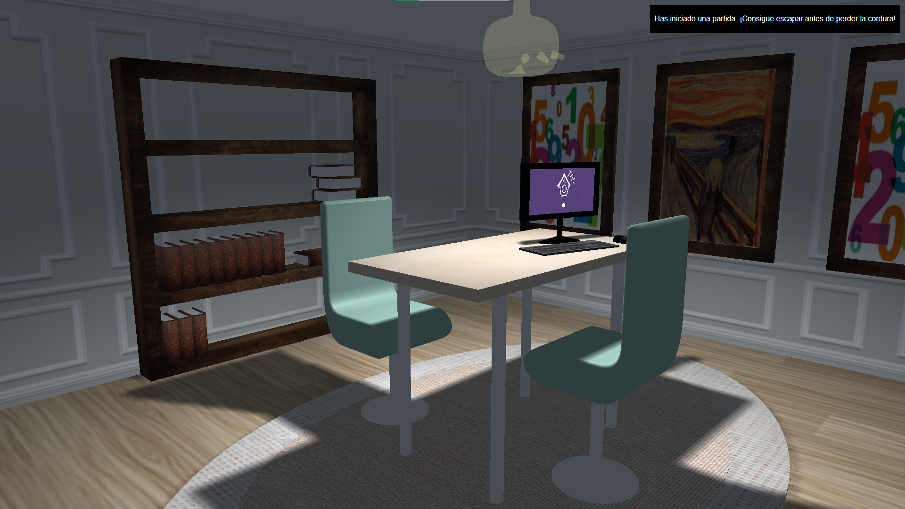
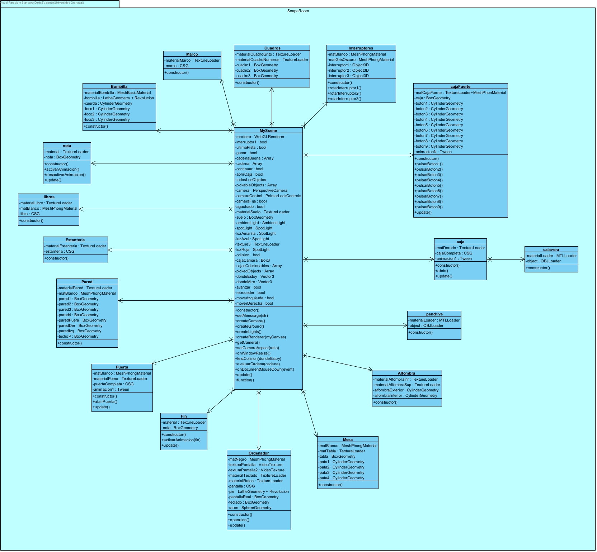
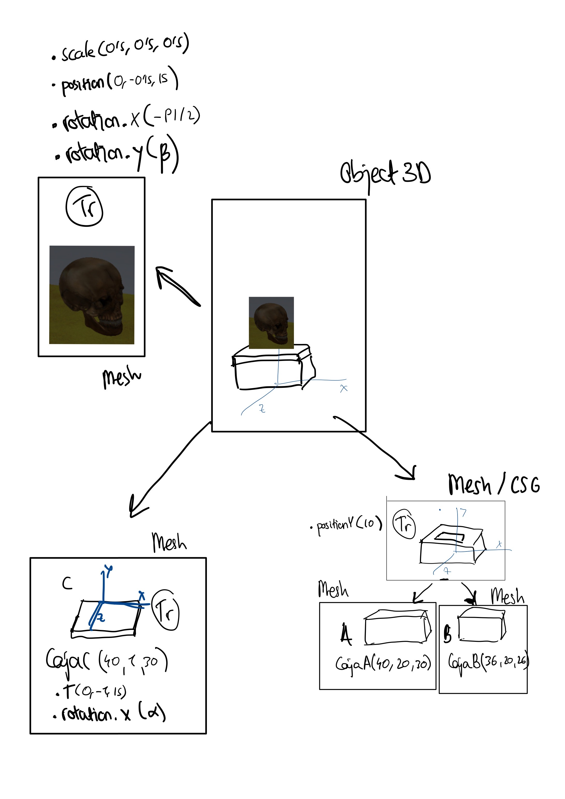

# 🏚️ La Casa de los Secretos

<p align="center">
  
  
  
</p>

<p align="center">
  <em>Un escape room virtual donde cada sombra guarda un misterio</em>
</p>

---

## ✨ Descripción

**La Casa de los Secretos** es un **videojuego interactivo tipo Scape Room** desarrollado en **JavaScript** utilizando la librería **three.js**. Sumérgete en una habitación enigmática llena de misterios interconectados donde tu objetivo es resolver **3 pistas** para escapar antes de que sea demasiado tarde.

Los mensajes en la esquina superior derecha te guiarán a través de tu aventura.

---

## 🎮 Capturas

<div align="center">
  
</div>

---

## 👥 Autores

| Desarrollador | GitHub |
|---------------|--------|
| Denis Stoyanov | [@denissvalentin](https://github.com/denissvalentin) |
| Alba Guisado | [@albaguisadof](https://github.com/albaguisadof) |

---

## 🛠️ Características Técnicas

| Característica | Descripción |
|----------------|-------------|
| **Motor de Colisiones** | Sistema de bounding boxes para evitar que el jugador atraviese paredes y objetos |
| **Animaciones** | Apertura de cajas, pulsación de botones, movimiento de notas |
| **Picking (Raycasting)** | Detección de objetos con clic del ratón |
| **Iluminación** | 3 tipos de luces: ambiental, spotlights dinámicos, luz parpadeante |
| **Sombras** | Proyección y recepción de sombras en tiempo real |
| **Texturas** | Texturas con relieve, vídeos en pantalla, mapeado complejo |
| **Modelado CSG** | Geometría Constructiva de Sólidos para estanterías y libros |
| **Modelos Jerárquicos** | Animación de la calavera sobre la tapa de la caja |

---

## 🚀 Instalación

```bash
# Clona el repositorio
git clone https://github.com/DenisSValentin/ScapeRoom_LaCasaDeLosSecretos.git

# Entra en la carpeta
cd ScapeRoom_LaCasaDeLosSecretos
```

---

## ▶️ Cómo Ejecutar

### Opción 1: Live Server (VS Code)
1. Instala la extensión [Live Server](https://marketplace.visualstudio.com/items?itemName=ritwickdey.LiveServer)
2. Haz clic derecho en `index.html` → **Open with Live Server**

### Opción 2: Python
```bash
python -m http.server 8000
# Abre http://localhost:8000 en tu navegador
```

---

## ⌨️ Controles

| Tecla | Acción |
|-------|--------|
| `W` / `A` / `S` / `D` | Moverse |
| `Flechas` | Moverse (alternativo) |
| `Ctrl` | Agacharse / Levantarse |
| `Shift` | Bloquear/Desbloquear ratón |
| `Ratón` | Mirar alrededor (con ratón desbloqueado) |
| `Clic Izquierdo` | Interactuar con objetos |

---

## 🧩 Guía del Juego (SPOILER)

```
╔══════════════════════════════════════════════════════════════════╗
║                        SOLUCIÓN COMPLETA                        ║
╚══════════════════════════════════════════════════════════════════╝

  PASOS PARA ESCAPAR:

  ┌──────────────────────────────────────────────────────────────┐
  │ 1. BUSCA LA NOTA                                             │
  │    - Estanteria -> 2a leja -> Libro tumbado                  │
  │    - Combinations: ACE, ABDF, ABDCEF, ACDBF, BACDFE          │
  └──────────────────────────────────────────────────────────────┘

  ┌──────────────────────────────────────────────────────────────┐
  │ 2. DESCIFRA EL CODIGO                                        │
  │    - Tres interruptores (pared) -> Enciende el de arriba     │
  │    - Proyeccion en cuadro: letras A,B,C,D,E,F                │
  │    - ACE->1 | ABDF->7 | ABDCEF->2 | ACDBF->4 | BACDFE->5     │
  │    - CODIGO: 17245                                           │
  └──────────────────────────────────────────────────────────────┘

  ┌──────────────────────────────────────────────────────────────┐
  │ 3. ABRE LA CAJA FUERTE                                       │
  │    - Introduce 17245 en la caja de botones                   │
  │    - Coge el pendrive -> Haz clic en el ordenador            │
  │    - Pantalla muestra "THE END"                              │
  └──────────────────────────────────────────────────────────────┘

  ┌──────────────────────────────────────────────────────────────┐
  │ 4. ESCAPA                                                    │
  │    - Puerta -> Clic en el pomo -> ERES LIBRE!                │
  └──────────────────────────────────────────────────────────────┘
```

---

## 🎯 Cómo Funciona el Juego

```
┌──────────────────────────────────────────────────────────────────┐
│                        ARQUITECTURA                              │
├──────────────────────────────────────────────────────────────────┤
│                                                                  │
│   ┌──────────┐    ┌──────────┐    ┌──────────┐                   │
│   │  MyScene │───▶│  Camera  │───▶│ Renderer │                   │
│   └──────────┘    └──────────┘    └──────────┘                   │
│         │                                  │                     │
│         ▼                                  ▼                     │
│   ┌──────────┐                         ┌──────────┐              │
│   │ Objects  │◀──── Colisiones ───────▶│  Lights  │              │
│   └──────────┘                         └──────────┘              │
│         │                                     │                  │
│         ▼                                     ▼                  │
│   ┌──────────┐                           ┌──────────┐            │
│   │ Picking   │◀─────────────────────────│  Events  │            │
│   │(Raycast) │       Interaccion         │(Teclado) │            │
│   └──────────┘                           └──────────┘            │
│                                                                  │
└──────────────────────────────────────────────────────────────────┘
```

### Ciclo de Juego
1. **Init** → Carga modelos, texturas, luces
2. **Update** → Procesa input, actualiza posición
3. **Render** → Dibuja la escena
4. **Repeat** → 60 FPS

---

## 📚 Documentación

### Diagrama de Clases
<div align="center">
  
</div>

### Modelo Jerárquico
<div align="center">
  
</div>

---

## 📊 Estadísticas

<p align="center">
  


</p>

---

## 📜 Licencia

Este proyecto está bajo la licencia **GPL-3.0**. Ver [LICENSE](LICENSE) para más detalles.

---

<div align="center">
  
*¿Podrás escapar de la casa de los secretos?* 🗝️

</div>
